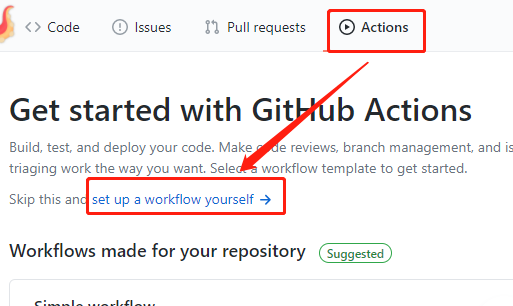
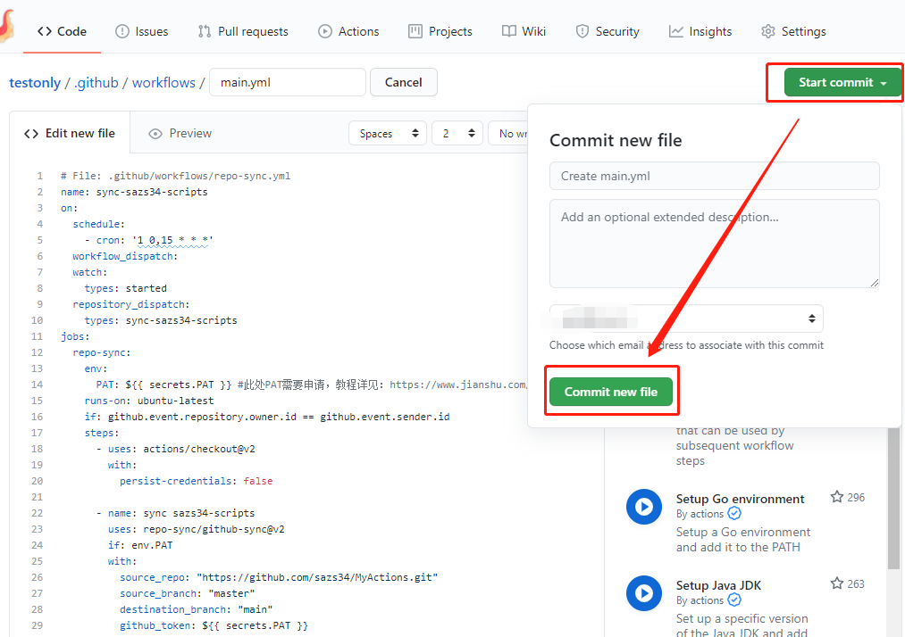
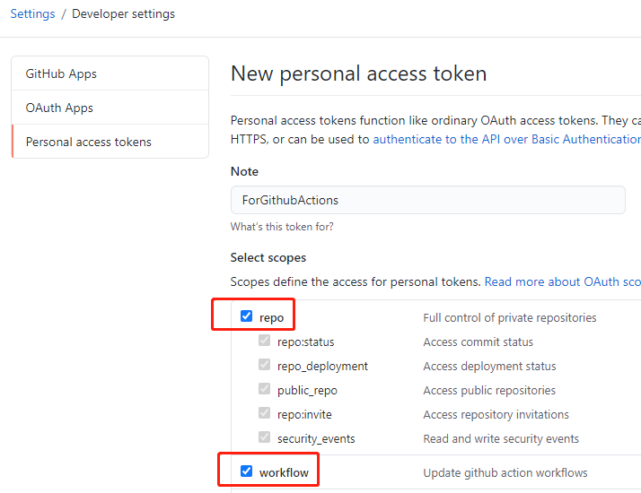
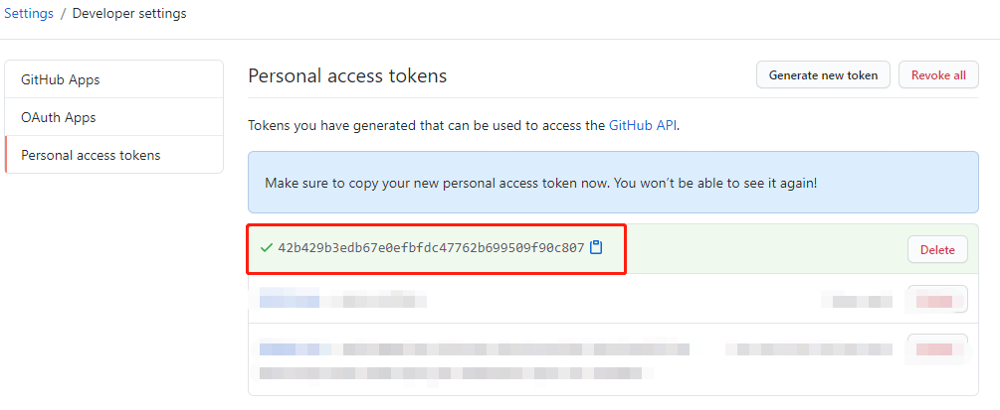
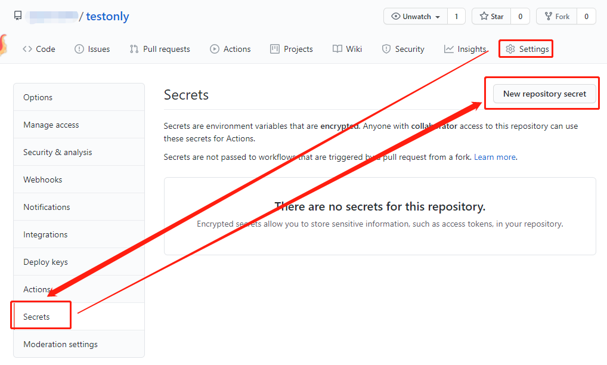
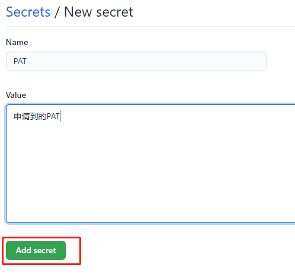
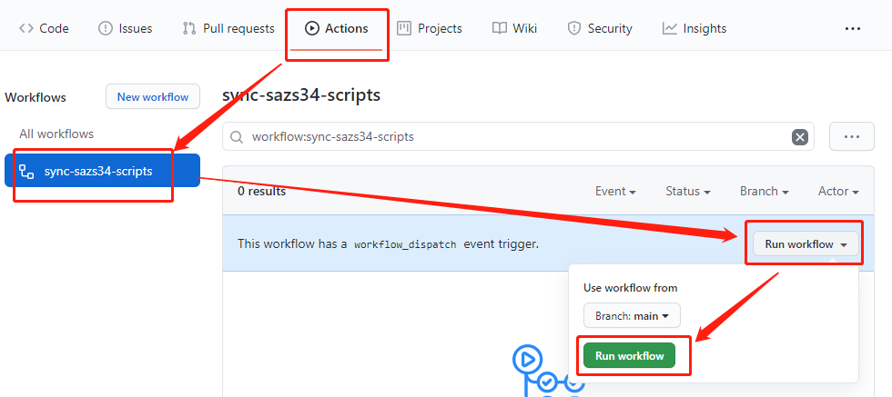
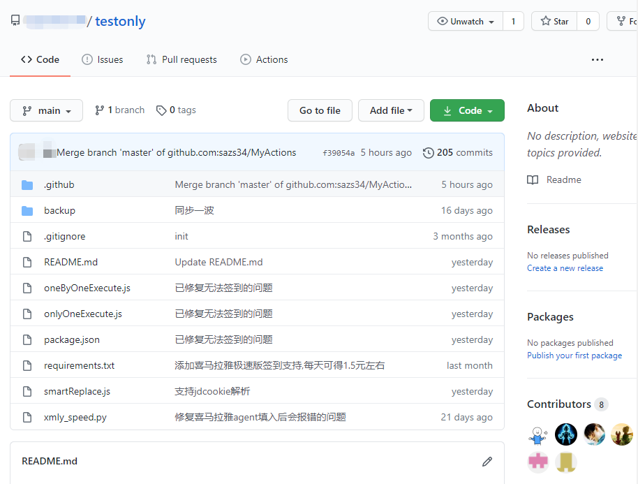

# 通过reposync方式进行代码同步

## Why

如果不想fork,通过下面的方法重新创建分支，同步代码

此方式亲测可行，请放心食用

当然别忘了对源仓库进行*Star* 

## How

### 创建新仓库

[点击创建自己的仓库](https://github.com/new)

填入`Repository name`后点击最下方的`Create repository`即可完成创建

如默认分支非`master`请自行修改`repo_sync.yml`的`destination_branch`或新建master分支并设置为默认分支
*Settings* -> *Branch* -> 重命名分支为`master`即可

### 自己创建工作流

在创建完成页面点击`Actions`再点击`set up a workflow yourself`

复制https://github.com/BlueskyClouds/My-Actions/blob/master/.github/workflows/repo_sync.yml 里面的代码

复制完毕后直接点击右上角的`Start commit`后直接`Commit new file`即可

### 申请PAT

点击 GitHub [用户设置页面](https://github.com/settings) 最下方的`Developer setting` ，然后选择 [`Personal access tokens`(点击快捷到达指定页面)](https://github.com/settings/tokens/new) 来生成一个 token，把 `repo`和`workflow` 两部分勾上即可。

点击最下面的创建按钮后，图示部分即为你的PAT(图示的已经删除了,仅为演示)，复制下来马上就要使用了

### 填写PAT到Secrets

申请完毕后，在分支中点击`Settings`-`Secrets`-`New secret`

`name`填`PAT`，`Value`填入上方申请到的PAT,保存即可

### 手动触发一次代码同步

点击`Actions`,找到指定的脚本,按图示运行一次

等待两分钟左右,能够发现代码全部同步过来了

## Enjoy

操作到这一步,表示您已经全部完成了

剩下的去配置cookie等secrets就好啦